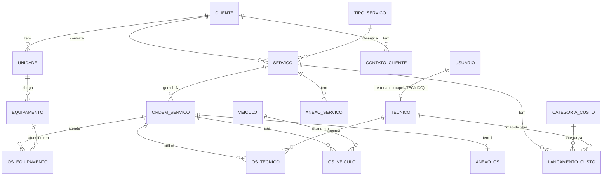

# 08 — Modelo de Dados

Entidades, relacionamentos e esquema lógico do banco para o OS-ALS.

Stack: **PostgreSQL** (Neon) + **Spring Boot** (JPA/Hibernate). Os tipos abaixo são os do PostgreSQL; o mapeamento Java é direto via JPA.

## Princípios de modelagem

- **pt-BR sem acentos** em nomes de tabelas e colunas (`ordem_servico`, `valor_hora_centavos`). Convenção alinhada com [15-padroes-backend.md §1](15-padroes-backend.md).
- **Auditoria mínima**: toda tabela operacional tem `created_at`, `created_by` (FK para `usuario`) e, quando aplicável, `updated_at`, `updated_by`.
- **Soft delete**: cadastros mestres (cliente, equipamento, técnico, veículo) usam `ativo BOOLEAN` em vez de DELETE físico.
- **Valores monetários em centavos** (`BIGINT`), sufixo `_centavos`. **Nunca** `NUMERIC`/`DECIMAL`/`DOUBLE` para dinheiro. Ver [09-arquitetura.md §8](09-arquitetura.md) e [15-padroes-backend.md §5](15-padroes-backend.md).
- **Snapshots de valores**: ao lançar mão de obra, o `valor_hora_centavos` do técnico é copiado no lançamento (não puxa por referência) — protege contra alteração retroativa do cadastro.
- **Sequenciais globais**: tanto Serviço quanto OS usam `SEQUENCE` do Postgres. Padding (zeros à esquerda) é feito na apresentação, não no banco.
- **Anexos**: o banco guarda apenas **metadados + chave do storage**; o blob físico fica em pasta local na V1 (ver [13](13-anexos.md)).

## Diagrama ER (visão geral)



## Tabelas

### 1. Autenticação e usuários

#### `usuario`
Usuários do sistema. Inclui operadores, gerentes, admins e técnicos.

| Coluna | Tipo | Notas |
|---|---|---|
| `id` | BIGSERIAL PK | |
| `nome` | VARCHAR(120) NOT NULL | |
| `email` | VARCHAR(160) NOT NULL UNIQUE | login |
| `senha_hash` | VARCHAR(255) NOT NULL | bcrypt/argon2 |
| `papel` | VARCHAR(20) NOT NULL | enum: `OPERADOR`, `GERENTE`, `ADMIN`, `TECNICO` |
| `ativo` | BOOLEAN NOT NULL DEFAULT TRUE | |
| `created_at` | TIMESTAMPTZ NOT NULL DEFAULT now() | |

#### `tecnico`
Dados específicos quando o usuário é da equipe técnica. Relação **1:1 com usuario** (chave primária = `usuario_id`).

| Coluna | Tipo | Notas |
|---|---|---|
| `usuario_id` | BIGINT PK, FK → usuario(id) | |
| `valor_hora_centavos` | BIGINT NOT NULL | usado no cálculo de mão de obra. Em centavos |
| `especialidade` | VARCHAR(80) | livre |
| `telefone` | VARCHAR(20) | contato direto |

> **Por quê 1:1 separada e não colunas nulas em `usuario`?** Mantém o cadastro de Usuario limpo (papéis administrativos não carregam campos irrelevantes). Facilita expandir o cadastro do técnico no futuro sem mexer no schema base de Usuario.

---

### 2. Cadastros mestres

#### `cliente`
| Coluna | Tipo | Notas |
|---|---|---|
| `id` | BIGSERIAL PK | |
| `tipo_pessoa` | CHAR(2) NOT NULL | `PF` ou `PJ` |
| `documento` | VARCHAR(20) NOT NULL UNIQUE | CPF ou CNPJ, só dígitos |
| `nome` | VARCHAR(160) NOT NULL | razão social ou nome completo |
| `nome_fantasia` | VARCHAR(160) | só PJ |
| `ativo` | BOOLEAN NOT NULL DEFAULT TRUE | |
| `created_at` | TIMESTAMPTZ NOT NULL DEFAULT now() | |

#### `contato_cliente`
Múltiplos contatos por cliente (responsável técnico, responsável geral, financeiro etc.).

| Coluna | Tipo | Notas |
|---|---|---|
| `id` | BIGSERIAL PK | |
| `cliente_id` | BIGINT NOT NULL FK → cliente(id) | |
| `nome` | VARCHAR(120) NOT NULL | |
| `funcao` | VARCHAR(60) | "Responsável técnico", "Diretor", etc. |
| `telefone` | VARCHAR(20) | |
| `email` | VARCHAR(160) | |

#### `unidade`
Endereço/filial do cliente onde equipamentos são instalados.

| Coluna | Tipo | Notas |
|---|---|---|
| `id` | BIGSERIAL PK | |
| `cliente_id` | BIGINT NOT NULL FK → cliente(id) | |
| `identificacao_interna` | VARCHAR(80) NOT NULL | "Matriz", "Filial Centro", "Loja 4" |
| `cep` | CHAR(8) | só dígitos |
| `logradouro` | VARCHAR(160) | |
| `numero` | VARCHAR(20) | |
| `complemento` | VARCHAR(80) | |
| `bairro` | VARCHAR(80) | |
| `cidade` | VARCHAR(80) | |
| `estado` | CHAR(2) | UF |
| `ativo` | BOOLEAN NOT NULL DEFAULT TRUE | |

#### `equipamento`
Inventário dos equipamentos instalados nas unidades dos clientes. ⭐

| Coluna | Tipo | Notas |
|---|---|---|
| `id` | BIGSERIAL PK | |
| `unidade_id` | BIGINT NOT NULL FK → unidade(id) | |
| `marca` | VARCHAR(60) | |
| `modelo` | VARCHAR(60) | |
| `numero_serie` | VARCHAR(60) | |
| `tipo` | VARCHAR(20) NOT NULL | enum: `SPLIT`, `MULTI_SPLIT`, `VRF`, `SELF`, `CHILLER`, `FAN_COIL`, `JANELA`, `OUTRO` |
| `capacidade_btus` | INTEGER | |
| `capacidade_tr` | NUMERIC(6,2) | TR = Tonelada de Refrigeração |
| `localizacao_interna` | VARCHAR(120) | "Andar 3 — Sala 305" |
| `data_instalacao` | DATE | |
| `data_ultima_manutencao` | DATE | atualizada manualmente ou via OS |
| `status` | VARCHAR(20) NOT NULL DEFAULT 'ATIVO' | `ATIVO`, `EM_MANUTENCAO`, `DESATIVADO`. **Editado manualmente** pelo operador (não derivado das OS) |
| `ativo` | BOOLEAN NOT NULL DEFAULT TRUE | soft delete |

#### `veiculo`
| Coluna | Tipo | Notas |
|---|---|---|
| `id` | BIGSERIAL PK | |
| `placa` | VARCHAR(8) NOT NULL UNIQUE | |
| `marca` | VARCHAR(40) | |
| `modelo` | VARCHAR(60) | |
| `ano` | INTEGER | |
| `status` | VARCHAR(20) NOT NULL DEFAULT 'ATIVO' | `ATIVO`, `MANUTENCAO`, `INATIVO` |
| `ativo` | BOOLEAN NOT NULL DEFAULT TRUE | |

#### `tipo_servico`
Configurável pelo admin.

| Coluna | Tipo | Notas |
|---|---|---|
| `id` | SERIAL PK | |
| `nome` | VARCHAR(80) NOT NULL UNIQUE | |
| `ativo` | BOOLEAN NOT NULL DEFAULT TRUE | |

**Seeds**: Instalação, Manutenção preventiva, Manutenção corretiva, Higienização/limpeza, Montagem.

#### `peca`
Catálogo de referência (sem estoque).

| Coluna | Tipo | Notas |
|---|---|---|
| `id` | BIGSERIAL PK | |
| `nome` | VARCHAR(120) NOT NULL | |
| `descricao` | VARCHAR(255) | |
| `unidade_medida_id` | INTEGER FK → unidade_medida(id) | |
| `ativo` | BOOLEAN NOT NULL DEFAULT TRUE | |

#### `unidade_medida`
| Coluna | Tipo | Notas |
|---|---|---|
| `id` | SERIAL PK | |
| `sigla` | VARCHAR(8) NOT NULL UNIQUE | `m`, `m2`, `kg`, `BTU`, `TR`, `h`, `un`, `pç` |
| `nome` | VARCHAR(40) NOT NULL | |

#### `fornecedor`
| Coluna | Tipo | Notas |
|---|---|---|
| `id` | BIGSERIAL PK | |
| `nome` | VARCHAR(160) NOT NULL | |
| `tipo_pessoa` | CHAR(2) | `PF`/`PJ` |
| `documento` | VARCHAR(20) | CPF/CNPJ |
| `telefone` | VARCHAR(20) | |
| `email` | VARCHAR(160) | |
| `ativo` | BOOLEAN NOT NULL DEFAULT TRUE | |

---

### 3. Configuração do sistema

#### `configuracao`
Chave-valor genérico para configurações globais editadas pelo admin.

| Coluna | Tipo | Notas |
|---|---|---|
| `chave` | VARCHAR(60) PK | |
| `valor` | VARCHAR(255) NOT NULL | armazenado como string; aplicação interpreta |
| `tipo` | VARCHAR(20) NOT NULL | `NUMBER`, `STRING`, `BOOLEAN` (para validação) |
| `descricao` | VARCHAR(255) | exibida na tela de configurações |
| `updated_at` | TIMESTAMPTZ NOT NULL DEFAULT now() | |
| `updated_by` | BIGINT FK → usuario(id) | |

**Seeds essenciais**:
- `markup_percentual` = `30.00` (alíquota percentual — não é dinheiro)
- `valor_km_centavos` = `150` (R$ 1,50 — em centavos)

#### `categoria_custo`
| Coluna | Tipo | Notas |
|---|---|---|
| `id` | SERIAL PK | |
| `nome` | VARCHAR(60) NOT NULL UNIQUE | |
| `codigo` | VARCHAR(20) NOT NULL UNIQUE | identificador estável usado no código: `MAO_OBRA`, `DESLOCAMENTO`, `PECAS`, `TERCEIROS`, `HOSPEDAGEM` |
| `tipo_lancamento` | VARCHAR(20) NOT NULL | `ESTRUTURADO_MAO_OBRA`, `ESTRUTURADO_DESLOCAMENTO`, `LIVRE` |
| `ativo` | BOOLEAN NOT NULL DEFAULT TRUE | |

> **Decisão**: as 5 categorias da V1 vêm como seed. O admin pode renomear e ativar/desativar, mas **não pode criar novas categorias** nesta versão — porque cada `tipo_lancamento` está acoplado a comportamento de cálculo no código. Criar categorias customizadas é evolução futura.

---

### 4. Núcleo: Serviço e OS

#### `servico`
| Coluna | Tipo | Notas |
|---|---|---|
| `id` | BIGSERIAL PK | |
| `numero` | INTEGER NOT NULL UNIQUE | sequencial global; exibido com 4 dígitos (`0001`) |
| `cliente_id` | BIGINT NOT NULL FK → cliente(id) | |
| `tipo_servico_id` | INTEGER NOT NULL FK → tipo_servico(id) | |
| `descricao` | TEXT NOT NULL | |
| `data_inicio_prevista` | DATE | cronograma — só no Serviço |
| `data_fim_prevista` | DATE | |
| `status` | VARCHAR(20) NOT NULL DEFAULT 'EM_ABERTO' | `EM_ABERTO`, `EM_EXECUCAO`, `AGUARDANDO`, `CONCLUIDO`, `CANCELADO` |
| `finalizado_em` | TIMESTAMPTZ | preenchido ao concluir |
| `finalizado_por` | BIGINT FK → usuario(id) | |
| `created_at` | TIMESTAMPTZ NOT NULL DEFAULT now() | |
| `created_by` | BIGINT NOT NULL FK → usuario(id) | |
| `updated_at` | TIMESTAMPTZ | |
| `updated_by` | BIGINT FK → usuario(id) | |

Sequência: `CREATE SEQUENCE servico_numero_seq START 1;`

#### `ordem_servico`
| Coluna | Tipo | Notas |
|---|---|---|
| `id` | BIGSERIAL PK | |
| `numero` | INTEGER NOT NULL UNIQUE | sequencial global; exibido com 5 dígitos (`00012`) |
| `servico_id` | BIGINT NOT NULL FK → servico(id) | OS sempre tem Serviço pai |
| `descricao_atividade` | TEXT NOT NULL | impressa para o técnico |
| `status` | VARCHAR(25) NOT NULL DEFAULT 'ABERTA' | `ABERTA`, `IMPRESSA`, `PENDENTE_DIGITACAO`, `CONCLUIDA`, `CANCELADA` |
| `data_abertura` | TIMESTAMPTZ NOT NULL DEFAULT now() | |
| `data_impressao` | TIMESTAMPTZ | |
| `hora_inicio_execucao` | TIMESTAMPTZ | preenchido na digitação |
| `hora_fim_execucao` | TIMESTAMPTZ | preenchido na digitação |
| `o_que_foi_feito` | TEXT | preenchido na digitação |
| `observacoes` | TEXT | |
| `impedimentos` | TEXT | |
| `digitado_em` | TIMESTAMPTZ | quando o operador digitou |
| `digitado_por` | BIGINT FK → usuario(id) | |
| `created_at` | TIMESTAMPTZ NOT NULL DEFAULT now() | |
| `created_by` | BIGINT NOT NULL FK → usuario(id) | |

Sequência: `CREATE SEQUENCE os_numero_seq START 1;`

**Código de exibição** (`SSSS-NNNNN`) é derivado: `LPAD(servico.numero::text, 4, '0') || '-' || LPAD(os.numero::text, 5, '0')`. Pode ser uma view ou cálculo no app.

#### `os_tecnico` (junção N:N)
| Coluna | Tipo | Notas |
|---|---|---|
| `os_id` | BIGINT NOT NULL FK → ordem_servico(id) | |
| `tecnico_id` | BIGINT NOT NULL FK → tecnico(usuario_id) | |
| **PK** | (os_id, tecnico_id) | |

#### `os_veiculo` (junção N:N)
| Coluna | Tipo | Notas |
|---|---|---|
| `os_id` | BIGINT NOT NULL FK → ordem_servico(id) | |
| `veiculo_id` | BIGINT NOT NULL FK → veiculo(id) | |
| **PK** | (os_id, veiculo_id) | |

#### `os_equipamento` (junção N:N — para histórico de manutenção)
| Coluna | Tipo | Notas |
|---|---|---|
| `os_id` | BIGINT NOT NULL FK → ordem_servico(id) | |
| `equipamento_id` | BIGINT NOT NULL FK → equipamento(id) | |
| **PK** | (os_id, equipamento_id) | |

---

### 5. Custos

#### `lancamento_custo`
Tabela única para todas as categorias. Colunas específicas ficam nulas quando não se aplicam.

| Coluna | Tipo | Notas |
|---|---|---|
| `id` | BIGSERIAL PK | |
| `servico_id` | BIGINT NOT NULL FK → servico(id) | custos só no Serviço |
| `categoria_custo_id` | INTEGER NOT NULL FK → categoria_custo(id) | |
| `descricao` | VARCHAR(255) | |
| `valor_total_centavos` | BIGINT NOT NULL | sempre preenchido (calculado ou livre). Em centavos |
| **Mão de obra**: | | |
| `tecnico_id` | BIGINT FK → tecnico(usuario_id) | |
| `horas` | NUMERIC(6,2) | tempo, não moeda |
| `valor_hora_snapshot_centavos` | BIGINT | snapshot do `valor_hora_centavos` do técnico no momento do lançamento |
| **Deslocamento**: | | |
| `km` | NUMERIC(8,2) | distância, não moeda |
| `valor_km_snapshot_centavos` | BIGINT | snapshot da configuração `valor_km_centavos` |
| **Auditoria**: | | |
| `created_at` | TIMESTAMPTZ NOT NULL DEFAULT now() | |
| `created_by` | BIGINT NOT NULL FK → usuario(id) | |
| `updated_at` | TIMESTAMPTZ | |
| `updated_by` | BIGINT FK → usuario(id) | |

**Constraint**: validação no app (não no banco, por simplicidade) — quando `categoria.codigo = 'MAO_OBRA'`, exigir `tecnico_id`, `horas`, `valor_hora_snapshot_centavos`. Quando `DESLOCAMENTO`, exigir `km`, `valor_km_snapshot_centavos`. Demais categorias usam só `descricao` + `valor_total_centavos`.

> **Alternativa considerada**: herança JPA (`@Inheritance(SINGLE_TABLE)` ou `JOINED`). Adiada — a tabela única é mais simples para começar e o banco continua legível em SQL puro.

> **Log de auditoria de custos**: fora da V1. Quando gerente/admin alterar custo em Serviço já Concluído, a alteração simplesmente sobrescreve. Auditoria detalhada (`log_alteracao_custo` com snapshot do valor anterior + motivo) entra em versão futura — ver [07-fora-de-escopo-v1.md](07-fora-de-escopo-v1.md).

---

### 6. Anexos

#### `anexo_servico`
Múltiplos PDFs por serviço (ver [13](13-anexos.md)).

| Coluna | Tipo | Notas |
|---|---|---|
| `id` | BIGSERIAL PK | |
| `servico_id` | BIGINT NOT NULL FK → servico(id) | |
| `nome_arquivo` | VARCHAR(255) NOT NULL | nome original do upload |
| `descricao` | VARCHAR(255) | opcional |
| `storage_key` | VARCHAR(500) NOT NULL | chave/caminho no object storage (S3 etc.) |
| `content_type` | VARCHAR(60) NOT NULL DEFAULT 'application/pdf' | |
| `tamanho_bytes` | BIGINT NOT NULL | |
| `created_at` | TIMESTAMPTZ NOT NULL DEFAULT now() | |
| `created_by` | BIGINT NOT NULL FK → usuario(id) | |

#### `anexo_os`
**Um** PDF por OS (scan do papel preenchido). Relação 1:1 com `ordem_servico`. Modelado como tabela separada (não coluna na OS) para uniformidade com `anexo_servico` e para evitar muitas colunas nulas em OS abertas que ainda não foram digitalizadas.

| Coluna | Tipo | Notas |
|---|---|---|
| `os_id` | BIGINT PK, FK → ordem_servico(id) | PK = FK garante 1:1 |
| `nome_arquivo` | VARCHAR(255) NOT NULL | |
| `storage_key` | VARCHAR(500) NOT NULL | |
| `content_type` | VARCHAR(60) NOT NULL DEFAULT 'application/pdf' | |
| `tamanho_bytes` | BIGINT NOT NULL | |
| `created_at` | TIMESTAMPTZ NOT NULL DEFAULT now() | |
| `created_by` | BIGINT NOT NULL FK → usuario(id) | substituição: DELETE+INSERT na mesma linha (PK por os_id) |

---

## Índices recomendados

- `idx_servico_cliente` em `servico(cliente_id)`
- `idx_servico_status` em `servico(status)` — filtros de listagem
- `idx_os_servico` em `ordem_servico(servico_id)` — listar OS de um Serviço
- `idx_os_status` em `ordem_servico(status)`
- `idx_unidade_cliente` em `unidade(cliente_id)`
- `idx_equipamento_unidade` em `equipamento(unidade_id)`
- `idx_lancamento_servico` em `lancamento_custo(servico_id)`
- Índices únicos já implícitos: `usuario.email`, `cliente.documento`, `veiculo.placa`, `servico.numero`, `ordem_servico.numero`

## Sequências do Postgres

```sql
CREATE SEQUENCE servico_numero_seq START 1;
CREATE SEQUENCE os_numero_seq START 1;
```

Aplicação consome via `nextval('servico_numero_seq')` ao criar Serviço/OS. Garante numeração global única e sem buracos induzidos por transações concorrentes.

## Decisões de modelagem e racional

| Decisão | Por quê |
|---|---|
| Técnico em tabela separada (1:1 com `usuario`) | Mantém o cadastro de Usuario limpo; permite evoluir o perfil técnico sem mexer no schema base |
| Custos em tabela única (não herança) | Simples; o app valida quais colunas exigir. Migrar para herança depois é viável se necessário |
| Snapshot de `valor_hora_centavos` e `valor_km_centavos` no lançamento | Protege contra alteração retroativa do cadastro — relatórios de períodos passados continuam corretos |
| Numeração via SEQUENCE | Concorrência segura e simples. Padding é cosmético, fica no app |
| Anexos em tabelas separadas (não coluna BYTEA) | Postgres não é boa opção para blobs em volume; usar storage externo é prática padrão |
| `categoria_custo` com `codigo` estável | O código (`MAO_OBRA` etc.) é usado no código-fonte; o nome é editável pelo admin sem quebrar regras |

## Decisões consolidadas

| Decisão | Resposta |
|---|---|
| Admin pode criar novas categorias de custo? | **Não** — apenas as 5 categorias seed; admin renomeia/desativa, não cria |
| Log de auditoria de alterações de custo (`log_alteracao_custo`)? | **Não na V1** — alterações sobrescrevem |
| Equipamento.status — manual ou derivado das OS? | **Manual** — operador edita |
| Object storage para anexos PDF | **Pasta local na V1** (filesystem para testes); produção define depois |
| Tamanho máximo de PDF | **10 MB** — app rejeita arquivos maiores |

## Próximos passos sugeridos

- Gerar migrations (Flyway ou Liquibase) a partir deste modelo
- Criar entidades JPA correspondentes
- Decidir convenção de nomenclatura no Java (camelCase ↔ snake_case via `@Column` ou `PhysicalNamingStrategy`)
