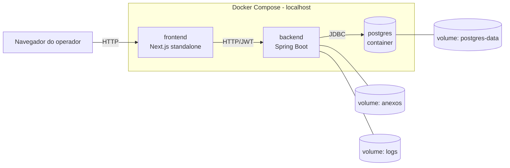

# 09 — Arquitetura

Arquitetura técnica do OS-ALS: camadas, stack, autenticação, banco, storage, integrações e convenções transversais.

> Para padrões de código do backend (DTOs, exception handler, testes, Flyway), ver [15-padroes-backend.md](15-padroes-backend.md). Este documento foca em decisões macro de arquitetura.

---

## 1. Visão de alto nível



- **Frontend**: Next.js (App Router) renderiza em servidor (SSR) e fala com a API por dentro de Server Components / Server Actions. JWT vive em cookie `httpOnly`; o cliente nunca toca no token.
- **Backend**: Spring Boot REST. Stateless (sem sessão), autenticação por JWT RS256.
- **Banco**: PostgreSQL **em container Docker** no localhost na V1. Volume `postgres-data` persiste dados. Em produção futura migra para banco gerenciado (Neon ou equivalente).
- **Storage de anexos**: pasta local (volume Docker `anexos`) montada em `ANEXOS_DIR` dentro do container do backend.
- **Logs**: pasta local (volume Docker `logs`) montada no backend; arquivos com rotação diária e retenção de 30 dias.

---

## 2. Backend — Spring Boot

### Versões alvo

| Item | Versão | Notas |
|---|---|---|
| Java | 17 (LTS) | alinhado com o api-salesys |
| Spring Boot | 4.0.6 | versão entregue pelo `start.spring.io` no momento da criação; atualizar via PR dedicado |
| Build | **Maven** | wrapper `./mvnw` no repo |
| Banco | PostgreSQL 16+ (Neon) | |
| ORM | Spring Data JPA + Hibernate | `ddl-auto: validate` em prod |
| Migrations | **Flyway** | `flyway-core` + `flyway-database-postgresql` |
| Validação | Bean Validation (`jakarta.validation`) | via `spring-boot-starter-validation` |
| Segurança | Spring Security | filtro JWT próprio (não usar `UserDetailsService` default) |
| JWT | **JJWT 0.12.6** (`io.jsonwebtoken`) | compatível com `jose` do front (RS256) |
| Variáveis de ambiente | **spring-dotenv** (`me.paulschwarz`) | carrega `.env` automaticamente |
| OpenAPI | **springdoc-openapi-starter-webmvc-ui** 2.8.6 | gera `/v3/api-docs` e Swagger UI |
| Testes | JUnit 5 + Mockito + Testcontainers (Postgres) | |
| Cobertura | JaCoCo (meta 80% nos services) | `./mvnw jacoco:report` |
| Geração de PDF | **OpenHTMLtoPDF** | converte HTML/Thymeleaf → PDF (layout da OS impressa) |

### Estrutura de pacotes

**Modular Monolith** — pacotes por módulo de negócio, com camadas internas `dominio/aplicacao/infraestrutura/api` em cada um. Convenção alinhada com o [api-salesys](D:\DEV\projetos\salesys\api-salesys-java).

```
br.com.empresa.osals/
├── OsAlsApplication.java
├── seguranca/                 ← login, usuário, JWT, permissões
│   ├── dominio/               ← Usuario, Papel, Permissao, RepositorioUsuarios
│   ├── aplicacao/             ← ServicoAutenticacao, ServicoUsuarios, DTOs
│   ├── infraestrutura/        ← FiltroJwt, GeradorJwt, configs de SecurityFilterChain
│   └── api/                   ← ControladorAutenticacao, ControladorUsuarios
├── cadastro/                  ← cliente, unidade, equipamento, técnico, veículo, peça, fornecedor
│   ├── dominio/
│   ├── aplicacao/
│   └── api/
├── servico/                   ← Servico, TipoServico, LancamentoCusto, CategoriaCusto
├── ordemservico/              ← OrdemServico + relações N:N (técnicos, veículos, equipamentos)
├── anexo/                     ← AnexoServico, AnexoOS, gateway de storage local
├── relatorio/                 ← endpoints agregados (OS por status, custos por serviço, etc.)
├── impressao/                 ← geração do PDF da OS impressa
└── compartilhado/             ← infra transversal (sem regra de negócio)
    ├── api/                   ← ErroResposta, PaginaResposta<T>, TratadorExcecoesGlobal
    ├── config/                ← SegurancaConfig, OpenApiConfig, JpaConfig
    ├── excecoes/              ← NegocioException, RecursoNaoEncontradoException, ...
    └── util/                  ← MoedaUtil, DataUtil
```

**Direção de dependências**:

```
ordemservico/ ──► servico/ ──► cadastro/ ──► seguranca/ ──► compartilhado/
anexo/        ──► servico/ + ordemservico/
relatorio/    ──► servico/ + ordemservico/ + cadastro/
impressao/    ──► ordemservico/ + cadastro/
```

Nunca dependência circular. Se um módulo precisar de algo de outro abaixo dele na hierarquia, extrair para `compartilhado/`.

**Regras entre camadas (dentro do mesmo módulo)**:
- `api/` depende de `aplicacao/`
- `aplicacao/` depende de `dominio/`
- `infraestrutura/` depende de `dominio/` e `aplicacao/`
- `dominio/` não depende de nenhuma outra camada do módulo

> **Detalhamento prático** (como escrever Controller, Service, DTO, Mapper, etc.): ver [15-padroes-backend.md](15-padroes-backend.md).

### Camadas

```
HTTP (JSON)
    ↓
Controller (Spring MVC + @Valid)
    ↓
Service (regras de negócio, @Transactional)
    ↓
Repository (Spring Data JPA)
    ↓
Postgres (Neon)
```

- **Controller** nunca acessa Repository direto.
- **Service** orquestra; é onde mora a regra (ex.: "operador não pode editar custo de Serviço Concluído").
- **Repository** só faz CRUD e consultas customizadas.
- **DTOs** isolam o cliente do schema interno. Mudanças no banco não vazam para a API.

### Tratamento global de exceções

`ExcecoesGlobais` (`@RestControllerAdvice`) converte exceções em `ErroResposta` padronizado:

```json
{
  "codigo": 422,
  "mensagem": "Não é possível reabrir um Serviço Concluído.",
  "timestamp": "2026-05-18T13:45:00"
}
```

- `MethodArgumentNotValidException` (Bean Validation) → 400 com mensagem agregada
- `NegocioException` (custom) → 422 com `mensagem` que **pode ser exibida ao usuário** (já em pt-BR)
- `RecursoNaoEncontradoException` → 404
- `DuplicidadeException` → 409
- `AccessDeniedException` → 403
- `AuthenticationException` → 401
- `RuntimeException` genérica → 500 com mensagem genérica (stack trace só no log)

A **mensagem em pt-BR amigável** é responsabilidade do backend. O front exibe direto em 422/409.

### Validação

- **Bean Validation** nos DTOs de entrada (`@NotBlank`, `@NotNull`, `@Size`, `@Email`, `@CPF`, etc.).
- **Regras de negócio** ficam no Service (`if (!servico.podeEditar()) throw new NegocioException(...)`).
- O front também valida com Zod, mas a verificação **real** é no backend — front é apenas UX.

### OpenAPI / Swagger

- `springdoc-openapi-starter-webmvc-ui` expõe `/swagger-ui.html` e `/v3/api-docs`.
- Toda anotação de Controller inclui `@Operation` com summary em pt-BR.
- DTOs anotados com `@Schema` quando precisar explicar campo.

### Logging

- SLF4J + Logback (default Spring Boot).
- Formato JSON estruturado em produção (lib `logstash-logback-encoder`).
- Nunca logar: senhas, tokens, body completo de respostas com dados pessoais.
- Nível padrão: `INFO`. `DEBUG` somente em dev.

---

## 3. Autenticação e autorização

### Visão geral

- JWT **RS256** (chave privada no backend assina, chave pública no front verifica).
- **Stateless** no backend. Front armazena tokens em **cookie `httpOnly`** (não acessível pelo JavaScript do cliente).
- **Dois tokens**:
  - **Access token**: ~24h. Usado em toda chamada à API.
  - **Refresh token**: ~30 dias. Usado para gerar novo access. Rotação em cada uso (reuso = revoga toda a família).
- **Versão de token**: incremento na coluna `usuario.versao_token` invalida todos os tokens emitidos antes (usado em reset de senha, logout global).

### Cookies de sessão (padrão do projeto)

| Cookie | Conteúdo | Vida | Flags |
|---|---|---|---|
| `osals_at` | Access token JWT | ~24h | `httpOnly`, `sameSite=Lax`, `secure` em produção |
| `osals_rt` | Refresh token | ~30 dias | mesmo |
| `osals_us` | Snapshot do usuário (id, nome, papel, permissões) | igual ao access | mesmo |

### Verificação em duas camadas no frontend

Mesmo padrão do salesys:

| Camada | Onde | O que faz |
|---|---|---|
| 1 — Rápida | `proxy.ts` (Next 16) | `decodeJwt()` otimista — verifica só `exp` e `aud`. Redireciona rotas privadas para `/login` quando token ausente/expirado. Sem criptografia, é rápido |
| 2 — Segura | `app/(privado)/layout.tsx` | `jwtVerify()` RS256 + checagem de `aud`. Em falha com cookie presente, redireciona para `/sair` (route handler que limpa cookies) |

**Ambas obrigatórias.** Camada 2 nunca pode ser pulada.

### Backend — verificação de token

`SegurancaConfig` configura `OncePerRequestFilter` que:
1. Lê o cookie `osals_at` (ou header `Authorization: Bearer ...` em testes/Postman)
2. Verifica assinatura RS256, `exp`, `aud`, `iss`
3. Compara `versao_token` do JWT com `usuario.versao_token` no banco — se diferente, 401
4. Popula `SecurityContextHolder` com o `Usuario` autenticado

### Autorização

- **Anotações** nos Controllers: `@PreAuthorize("hasRole('ADMIN')")` ou `@PreAuthorize("hasAnyAuthority('servico.editar')")`
- Lista de **permissões** segue o padrão `<modulo>.<recurso>.<acao>` (ex.: `servico.criar`, `custo.editar_apos_concluido`).
- Lista canônica fica em `comum/enums/Permissao.java` e replicada em `app/lib/permissoes.ts` no front.
- **Anti-escalação**: nunca expor a verificação só ao front. Backend rejeita 403 mesmo que o front tenha mostrado o botão.

### Recuperação de senha

🔸 **Pendente** — entra na V1?
- Se sim: implica configurar um sender de e-mail (SMTP, SendGrid, AWS SES). Não é grande, mas precisa decidir.
- Se não: admin precisa criar/resetar senha de outros usuários manualmente.

---

## 4. Frontend — Next.js (resumo arquitetural)

Detalhes em [14-ui-padroes.md](14-ui-padroes.md). Aqui só os pontos arquiteturais.

### Cliente HTTP centralizado

`app/lib/cliente-api.ts` é **único ponto de chamada à API**. Nenhum `fetch` cru em outros arquivos.

```ts
// Esqueleto conceitual
export async function clienteApi<T>(
  caminho: string,
  opcoes?: { method?: string; body?: unknown; timeoutMs?: number }
): Promise<T> {
  // monta URL com API_BASE_URL
  // injeta Authorization a partir do cookie
  // timeout 15s
  // converte ErroResposta da API em ErroApi
  // converte falha de rede em ErroConexao
}
```

Tipos canônicos:

```ts
export type ErroRespostaBackend = {
  codigo: number       // duplica o HTTP status
  mensagem: string     // pt-BR amigável
  timestamp: string    // ISO-8601
}

export class ErroApi extends Error {
  constructor(public readonly status: number, public readonly body: ErroRespostaBackend) {
    super(body.mensagem)
  }
}

export class ErroConexao extends Error {} // timeout ou rede
```

### Fluxos

- **Leitura**: Server Components com `async/await`. Sem `useEffect`, sem SWR, sem React Query.
- **Mutação**: Server Actions (`'use server'`), recebem `FormData`, validam com Zod, chamam `clienteApi`, fazem `revalidatePath`.
- **Erros 4xx/5xx**: capturados na Action e retornados como estado tipado (`{ erro?, errosCampos? }`).

---

## 5. Banco de dados

### V1: Postgres em container Docker

- Imagem `postgres:16-alpine` no `docker-compose.yml`.
- Volume `postgres-data` (named volume do Docker) persiste os dados entre reinicializações do container.
- Configurado por variáveis de ambiente do `.env` (usuário, senha, database).
- Acesso do backend via JDBC na rede interna do Compose (`postgres:5432`).
- Healthcheck no Compose (`pg_isready`) para garantir que o backend só sobe quando o banco está pronto.

### Produção futura

Migrar para banco gerenciado (Neon, RDS, ou equivalente). Não muda código do backend — só a `BD_URL`. Backup automático e PITR ficam para essa etapa.

### Migrations: Flyway

- Convenção: `V<###>__<descricao_sem_acentos>.sql` em `src/main/resources/db/migration/` (3 dígitos sequenciais)
- Exemplo: `V001__criar_tabela_usuarios.sql`, `V010__seed_categorias_custo.sql`
- Migrations **nunca são editadas** após executar em qualquer ambiente. Para corrigir, criar nova migration. Flyway calcula checksum sobre o arquivo inteiro.
- Seeds (categorias de custo, tipos de serviço iniciais) em migrations próprias e idempotentes (`INSERT ... ON CONFLICT DO NOTHING`).
- Detalhe + protocolo de checksum mismatch em [15-padroes-backend.md §6](15-padroes-backend.md).

### Convenções de schema

- `snake_case` pt-BR sem acentos para tabelas e colunas (`ordem_servico`, `valor_hora_centavos`).
- Toda tabela operacional tem `id BIGSERIAL`. UUID fora da V1.
- Datas como `TIMESTAMPTZ`. Banco armazena em UTC; aplicação converte para `America/Sao_Paulo` na borda.
- Valores monetários como `BIGINT` (centavos), sempre — não `NUMERIC` nem `DECIMAL`. Ver §8.

---

## 6. Storage de anexos

### V1 — pasta local

- Variável de ambiente: `ANEXOS_DIR=/var/os-als/anexos` (configurável por ambiente)
- Estrutura interna:
  ```
  $ANEXOS_DIR/
  ├── servicos/<servico_id>/<uuid>.pdf
  └── ordens-servico/<os_id>.pdf
  ```
- Banco guarda apenas a `storage_key` (caminho relativo).
- **Servir o arquivo** via endpoint protegido do backend (não diretório estático aberto):
  - `GET /api/anexos/servico/{id}` → 302 ou stream direto, depois de verificar JWT + permissão
  - Headers: `Content-Type: application/pdf`, `Content-Disposition: inline; filename="..."` para abrir em nova aba
- **Upload** via `multipart/form-data` no backend:
  - Verifica `content-type` declarado (`application/pdf`)
  - Verifica **assinatura mágica** do PDF (primeiros bytes: `%PDF-`)
  - Verifica tamanho ≤ 10 MB
  - Salva no FS, grava metadados no banco

### Evolução — object storage externo

Não muda o schema do banco. Muda apenas o componente `StorageGateway` (interface) — implementação atual `StorageGatewayLocal` é trocada por `StorageGatewayS3` (ou R2/Supabase/MinIO).

---

## 7. Geração de PDF da OS

A OS impressa (ver [12](12-impressao-os.md)) é gerada pelo backend ao chamar `POST /api/ordens-servico/{id}/imprimir`.

### Proposta: OpenHTMLtoPDF

- Template Thymeleaf renderiza HTML com a estrutura da OS
- Lib converte HTML → PDF
- Vantagem: layout em HTML/CSS, fácil de iterar
- Alternativa: Apache PDFBox (mais baixo nível) ou iText (licença AGPL — cuidado)

### Fluxo

1. Front chama `GET /api/ordens-servico/{id}/imprimir`
2. Backend valida acesso, carrega OS + Serviço + Cliente + Equipamentos + Técnicos + Veículos
3. Renderiza template Thymeleaf
4. Converte para PDF in-memory
5. Retorna como `application/pdf` com `Content-Disposition: inline; filename="OS-0001-00012.pdf"`
6. Status da OS muda para `Impressa` (`data_impressao = now()`)

> **PDF gerado não é arquivado** (ver decisão em [12](12-impressao-os.md)). Apenas o scan do papel preenchido é anexado depois.

---

## 8. Convenções cross-cutting

### Timezone

- **Banco**: UTC (`TIMESTAMPTZ` no Postgres).
- **API (JSON)**: ISO-8601 sem timezone (assume UTC). `"2026-05-18T13:45:00"`
- **UI**: exibe em `America/Sao_Paulo`. Conversão acontece no front (Server Component) usando `Intl.DateTimeFormat`.

### Datas (formato)

- Datas puras (sem hora): `"2026-05-18"` (LocalDate no back, string no front).
- Data+hora: `"2026-05-18T13:45:00"` (LocalDateTime no back).
- Para `<input type="datetime-local">`: vem como `YYYY-MM-DDTHH:MM` (sem segundos). Schema Zod adiciona `:00` antes de enviar.

### Valores monetários

- **Banco e API**: **centavos como `BIGINT`/`Long`**, sempre. `R$ 299,90` → `29990`.
- Campos sempre com sufixo `_centavos` no banco (`valor_total_centavos`, `valor_hora_centavos`) e `Centavos` no DTO (`valorTotalCentavos`).
- Nunca `float`, `double`, `BigDecimal` ou `NUMERIC` para dinheiro. A aritmética de centavos é exata e o transporte é uniforme.
- Conversão de string ("R$ 299,90") para `Long` acontece **na UI ou no helper de entrada**, usando `Math.round` para evitar erro de ponto flutuante. Helper em `compartilhado/util/MoedaUtil.java` no back; `app/lib/moeda.ts` no front.
- UI converte para reais (`"R$ 299,90"`) apenas na renderização.

### Documentos (CPF/CNPJ/CEP/telefone)

- **Persistência**: apenas dígitos (sem máscara).
- **API**: aceita com ou sem máscara, persiste limpo.
- **UI**: aplica máscara só na exibição/edição.
- **Validação de dígito verificador** acontece no backend (422 se inválido).

### Enums

- **Banco**: `VARCHAR` (não usar `ENUM` do Postgres — dor de cabeça pra evoluir).
- **API**: strings em `UPPER_SNAKE_CASE` (`EM_ABERTO`, `PENDENTE_DIGITACAO`) — mesmo formato do nome do `enum class` Java, sem custo de conversão.
- **Frontend tipa**: `type StatusServico = 'EM_ABERTO' | 'EM_EXECUCAO' | ...`

> Divergência proposital em relação ao salesys (lá enums vão em `lowercase_snake_case`). Pra OS-ALS escolhemos UPPER por simetria com `enum class` e zero conversão. Decisão revisável.

### Paginação

Resposta paginada padrão:

```ts
type PaginaResposta<T> = {
  conteudo: T[]
  pagina: number          // zero-based
  tamanho: number         // default 20
  totalElementos: number
  totalPaginas: number
}
```

Query string: `?pagina=0&tamanho=20&ordenarPor=criadoEm&direcao=desc`. **Sem cursor.**

### IDs

- **Tipo no banco**: `BIGINT` (`BIGSERIAL` para PK).
- **API**: número.
- **Front**: `number` (não string).
- **UUIDs** ficam fora da V1 (BIGINT é mais barato e suficiente).

### Mensagens ao usuário

- Sempre **pt-BR sem acentos**, geradas no backend para 422/409.
- Texto amigável, sem jargão técnico, sem stack.
- Para 4xx genéricos e 5xx, o front mapeia mensagens locais.

### Identificadores (código)

- **pt-BR sem acentos** em classes, métodos, variáveis, pacotes, colunas de tabela, endpoints, permissões — ver [15-padroes-backend.md §1](15-padroes-backend.md).

---

## 9. Ambientes

### V1 — modo híbrido (padrão para dev)

**Postgres em container, backend e frontend nativos.** Este é o modo recomendado para o dia a dia de programação:

| Componente | Como roda |
|---|---|
| `postgres` | container Docker (`docker compose up -d postgres`) |
| `backend` | nativo (`./mvnw spring-boot:run`) — hot reload via Spring DevTools |
| `frontend` | nativo (`npm run dev`) — fast refresh do Next.js |

**Por quê híbrido**: hot reload rápido, debug direto da IDE, builds nativos rápidos, sem overhead do Docker no app. Padrão da indústria em times Java/Node.

### Modo alternativo — tudo em Docker

Mantido para **smoke test antes do PR**, **CI** ou **onboarding inicial** (quando o dev não tem Java/Node instalados).

**Tudo roda em containers** via `docker compose up -d`. Três serviços + três volumes:

```
docker-compose.yml (raiz do monorepo)
├── service: postgres      (postgres:16-alpine)        → volume postgres-data
├── service: backend       (Dockerfile do back)        → volumes anexos, logs
└── service: frontend      (Dockerfile do front)
```

| Componente | Imagem / build | Porta exposta | Volumes |
|---|---|---|---|
| `postgres` | `postgres:16-alpine` | 5432 (rede interna) | `postgres-data` → `/var/lib/postgresql/data` |
| `backend` | Build do `backend/Dockerfile` (multi-stage Maven + JRE 17) | 8080 → host:8080 | `anexos` → `/var/os-als/anexos`, `logs` → `/var/log/os-als` |
| `frontend` | Build do `frontend/Dockerfile` (multi-stage Node 20 + Next standalone) | 3000 → host:3000 | — |

**Acesso**:
- Frontend: `http://localhost:3000`
- Backend: `http://localhost:8080` (`/swagger-ui.html` em dev)
- Postgres: `localhost:5432` (se precisar conectar com cliente externo tipo DBeaver) — opcional

### Dockerfile do backend (esboço)

```dockerfile
# Stage 1: build com Maven
FROM eclipse-temurin:17-jdk-alpine AS build
WORKDIR /app
COPY mvnw pom.xml ./
COPY .mvn .mvn
RUN ./mvnw dependency:go-offline -B
COPY src src
RUN ./mvnw package -DskipTests -B

# Stage 2: runtime
FROM eclipse-temurin:17-jre-alpine
WORKDIR /app
COPY --from=build /app/target/*.jar app.jar
EXPOSE 8080
ENTRYPOINT ["java","-jar","app.jar"]
```

### Dockerfile do frontend (esboço)

```dockerfile
# Stage 1: deps
FROM node:20-alpine AS deps
WORKDIR /app
COPY package*.json ./
RUN npm ci

# Stage 2: build
FROM node:20-alpine AS build
WORKDIR /app
COPY --from=deps /app/node_modules ./node_modules
COPY . .
RUN npm run build

# Stage 3: runtime (Next.js standalone)
FROM node:20-alpine
WORKDIR /app
ENV NODE_ENV=production
COPY --from=build /app/.next/standalone ./
COPY --from=build /app/.next/static ./.next/static
COPY --from=build /app/public ./public
EXPOSE 3000
CMD ["node", "server.js"]
```

`next.config.ts` precisa de `output: 'standalone'` para esse build funcionar.

### Compose (esboço)

```yaml
services:
  postgres:
    image: postgres:16-alpine
    environment:
      POSTGRES_USER: ${BD_USUARIO}
      POSTGRES_PASSWORD: ${BD_SENHA}
      POSTGRES_DB: ${BD_NOME}
    volumes:
      - postgres-data:/var/lib/postgresql/data
    healthcheck:
      test: ["CMD-SHELL", "pg_isready -U ${BD_USUARIO}"]
      interval: 5s
      retries: 5

  backend:
    build: ./backend
    depends_on:
      postgres: { condition: service_healthy }
    env_file: .env
    environment:
      BD_URL: jdbc:postgresql://postgres:5432/${BD_NOME}
    volumes:
      - anexos:/var/os-als/anexos
      - logs:/var/log/os-als
    ports: ["8080:8080"]

  frontend:
    build: ./frontend
    depends_on: [backend]
    env_file: .env
    environment:
      API_BASE_URL: http://backend:8080
    ports: ["3000:3000"]

volumes:
  postgres-data:
  anexos:
  logs:
```

### Comandos do dia a dia

```bash
docker-compose up -d                       # subir tudo
docker-compose logs -f backend             # ver logs do back em tempo real
docker-compose exec backend sh             # entrar no container
docker-compose exec postgres psql -U ...   # conectar no banco
docker-compose down                        # parar (mantém volumes)
docker-compose down -v                     # parar e apagar volumes (reset total)
```

### Resumo dos comandos por modo

**Modo híbrido (padrão)** — postgres em container, app nativo:

```bash
docker compose up -d postgres                  # só o banco
cd api-osals.java && ./mvnw spring-boot:run    # back nativo
cd app-osals.nextjs && npm run dev             # front nativo (depois da Fase 0 do front)
```

**Modo "tudo em Docker"** — smoke test/CI/onboarding:

```bash
docker compose up -d --build
```

> Importante: no modo híbrido, ajustar `BD_URL=jdbc:postgresql://localhost:5432/osals` no `.env` (host = `localhost`). No modo "tudo em Docker", `BD_URL=jdbc:postgresql://postgres:5432/osals` (host = nome do serviço).

### Produção

🔸 **A definir depois da V1.** Estratégias possíveis:
- Mesmo `docker-compose` em VPS (DigitalOcean, Hetzner, AWS Lightsail)
- Backend e Postgres em serviços gerenciados (Railway, Render, Fly.io + Neon)
- Kubernetes (overkill para escopo atual)

> Importante: se o backend rodar em **múltiplas instâncias**, o volume `anexos` precisa ser compartilhado (NFS, S3, etc.) ou migrar para object storage. V1 assume **uma instância só**.

---

## 10. Variáveis de ambiente

Variáveis em **pt-BR sem acentos**, carregadas via `spring-dotenv` (back) e `.env.local` (front).

### Backend (`.env` + `application.yml`)

| Variável | Tipo | Notas |
|---|---|---|
| `BD_URL` | string | URL JDBC. Em Docker Compose: `jdbc:postgresql://postgres:5432/${BD_NOME}`. Em dev sem Docker: `jdbc:postgresql://localhost:5432/osals` |
| `BD_USUARIO` | string | usuário do Postgres (definido no Compose) |
| `BD_SENHA` | string | senha do Postgres |
| `BD_NOME` | string | nome do database (ex.: `osals`) |
| `JWT_CHAVE_PRIVADA` | PEM (multiline) | RS256 |
| `JWT_CHAVE_PUBLICA` | PEM | compartilhada com o front |
| `JWT_EMISSOR` | string | `os-als` |
| `JWT_AUDIENCE` | string | `tenant` |
| `JWT_EXPIRACAO_MINUTOS` | number | `1440` (24h) |
| `JWT_REFRESH_EXPIRACAO_DIAS` | number | `30` |
| `APP_PORTA` | number | `8080` |
| `APP_URL_BASE` | string | `http://localhost:8080` em dev |
| `FRONTEND_URL` | string | `http://localhost:3000` em dev |
| `ANEXOS_DIR` | path | `/var/os-als/anexos` (volume Docker) ou `./anexos-local` em dev nativo |
| `LOGS_DIR` | path | `/var/log/os-als` (volume Docker) ou `./logs` em dev nativo |
| `ANEXO_TAMANHO_MAX_MB` | number | `10` |
| `MARKUP_PADRAO` | number | seed inicial (admin altera via UI depois) |
| `VALOR_KM_CENTAVOS_PADRAO` | number | seed inicial em centavos |
| `LOGIN_MAX_TENTATIVAS` | number | `5` |
| `LOGIN_BLOQUEIO_MINUTOS` | number | `15` |
| `BCRYPT_FORCA` | number | `10` |
| `CORS_ORIGENS_PERMITIDAS` | csv | `http://localhost:3000` em dev |
| `CORS_METODOS_PERMITIDOS` | csv | `GET,POST,PUT,DELETE,PATCH,OPTIONS` |

### Frontend (`.env.local`)

| Variável | Tipo | Notas |
|---|---|---|
| `API_BASE_URL` | string (server-only) | URL do backend; sem `NEXT_PUBLIC_` |
| `JWT_CHAVE_PUBLICA_PEM` | PEM (server-only) | para validar JWT na camada 2 |
| `JWT_EMISSOR` | string | bate com backend `JWT_EMISSOR` |
| `JWT_AUDIENCE` | string | bate com backend `JWT_AUDIENCE` |

**Regras**:
- Nada sensível com prefixo `NEXT_PUBLIC_`
- Nada de variável de back vazando pro bundle do front
- `.env` (back) e `.env.local` (front) **nunca** vão pro git
- Aplicação **deve falhar no boot** se variáveis obrigatórias faltarem (`@ConfigurationProperties` + `@Validated`)

---

## 11. Observabilidade (V1 — mínimo)

### Healthcheck
- `GET /actuator/health` (Spring Actuator) — público. Usado pelo Compose para depends_on do front.
- `GET /actuator/info` — público (commit hash, versão).

### Logs em arquivo

Configurados em `src/main/resources/logback-spring.xml`:

- **Arquivo principal**: `${LOGS_DIR}/os-als.log`
- **Rotação**: diária (`%d{yyyy-MM-dd}`)
- **Retenção**: 30 dias (Logback descarta arquivos mais antigos automaticamente)
- **Compressão**: arquivos rotacionados são gzipados (`os-als.2026-05-17.log.gz`)
- **Formato**: texto humano (não JSON) com timestamp, level, thread, classe, mensagem
- **Console**: também imprime no stdout (útil para `docker-compose logs -f backend`)

Esboço do `logback-spring.xml`:

```xml
<configuration>
  <property name="LOGS_DIR" value="${LOGS_DIR:-./logs}"/>

  <appender name="ARQUIVO" class="ch.qos.logback.core.rolling.RollingFileAppender">
    <file>${LOGS_DIR}/os-als.log</file>
    <rollingPolicy class="ch.qos.logback.core.rolling.TimeBasedRollingPolicy">
      <fileNamePattern>${LOGS_DIR}/os-als.%d{yyyy-MM-dd}.log.gz</fileNamePattern>
      <maxHistory>30</maxHistory>
    </rollingPolicy>
    <encoder>
      <pattern>%d{yyyy-MM-dd HH:mm:ss.SSS} [%thread] %-5level %logger{36} - %msg%n</pattern>
    </encoder>
  </appender>

  <appender name="CONSOLE" class="ch.qos.logback.core.ConsoleAppender">
    <encoder>
      <pattern>%d{HH:mm:ss.SSS} %-5level %logger{36} - %msg%n</pattern>
    </encoder>
  </appender>

  <root level="INFO">
    <appender-ref ref="ARQUIVO"/>
    <appender-ref ref="CONSOLE"/>
  </root>

  <logger name="br.com.empresa.osals" level="INFO"/>
  <logger name="org.hibernate.SQL" level="WARN"/>
  <logger name="org.springframework.security" level="INFO"/>
</configuration>
```

Como `LOGS_DIR` é um volume montado, o arquivo persiste mesmo recriando o container.

### Métricas detalhadas
Prometheus, Grafana, etc. — fora da V1.

---

## 12. CI/CD (esboço)

Não definir pipeline completo na V1, mas o caminho recomendado:

| Etapa | O que faz |
|---|---|
| PR aberta | Lint (front), `tsc --noEmit` (front), `mvn test` (back), `mvn package` (back) |
| Merge na `main` | Build, push imagem Docker do back, deploy automático |
| Deploy do front | Vercel ou GitHub Actions → provedor escolhido |
| Migrations | Flyway roda no startup do backend (config padrão) |

---

## 13. Decisões consolidadas

- ✅ **Build tool**: Maven (`./mvnw`)
- ✅ **Estrutura de pacotes**: Modular Monolith com camadas `dominio/aplicacao/infraestrutura/api`
- ✅ **Lib JWT**: JJWT 0.12.6
- ✅ **Lib de PDF**: OpenHTMLtoPDF + Thymeleaf
- ✅ **Idioma do código**: pt-BR sem acentos
- ✅ **IDs**: BIGINT sequencial
- ✅ **Moeda**: centavos em `BIGINT` no banco e `Long` no transit
- ✅ **JWT TTL**: 24h access / 30 dias refresh
- ✅ **Rate limit interno** (Bucket4j): fora da V1; só Nginx (quando houver proxy em prod)
- ✅ **Recuperação de senha**: fora da V1 (admin reseta)
- ✅ **Hospedagem V1**: Docker Compose no localhost (backend + frontend + postgres)
- ✅ **Logs**: arquivo com rotação diária, retenção 30 dias (Logback `TimeBasedRollingPolicy`)
- ✅ **Banco V1**: Postgres em container; produção migra para gerenciado depois

---

## 14. Próximos passos

1. Gerar esqueleto do backend via `start.spring.io` (Maven, Java 17, deps: Web, JPA, Security, Validation, PostgreSQL, Flyway)
2. Gerar esqueleto do frontend (`create-next-app` + setup de Tailwind v4 conforme [14](14-ui-padroes.md))
3. Criar `Dockerfile` do back, `Dockerfile` do front e `docker-compose.yml` na raiz com os 3 serviços
4. Configurar `logback-spring.xml` (rotação diária, retenção 30 dias)
5. Primeira migration Flyway com o schema do [08](08-modelo-de-dados.md)
6. Implementar autenticação como primeira feature (login + verificação JWT) seguindo [15](15-padroes-backend.md)
